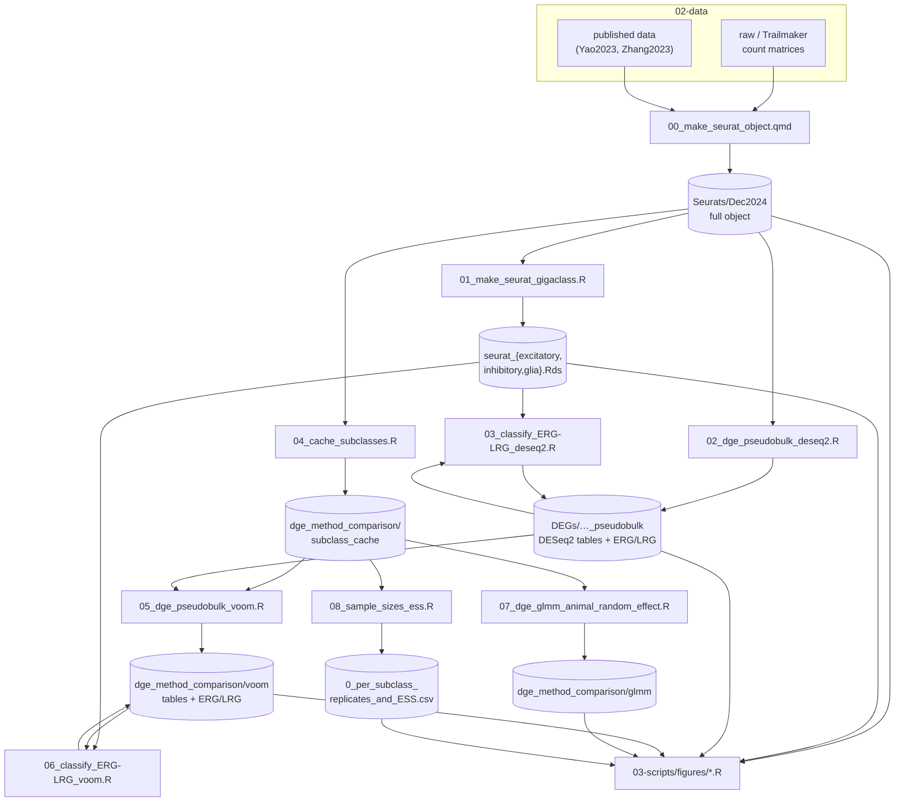
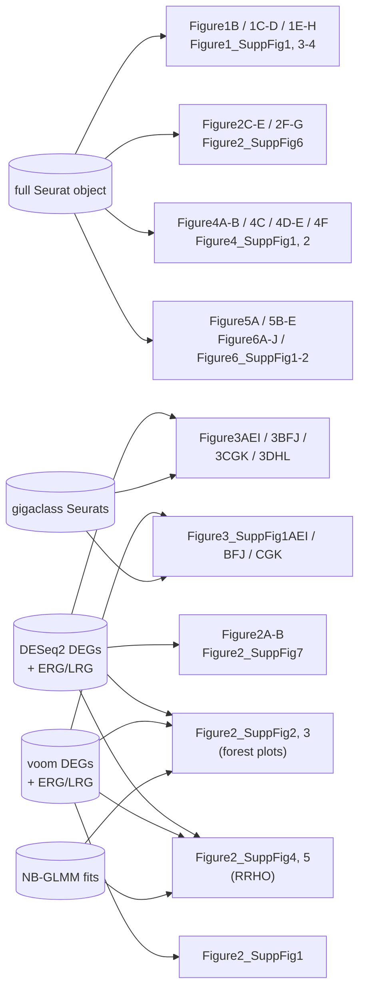

# Intermediate analysis workflow

Scripts in `03-scripts/R/` that produce **intermediate artefacts** (Seurat
objects, DEG tables, model fits) rather than manuscript figures. Every figure
script in `03-scripts/figures/` assumes these have already been run.

Run them in the numbered order below. All paths are relative to the repository
root; run everything from the root (the `.Rproj` sets this for you, and
`_quarto.yml` sets `execute-dir: project` so notebooks match).

`seq_functions.R` is a utility library, not a stage — every script `source()`s it.

## Run order

| # | Script | Writes | Requires |
|---|--------|--------|----------|
| 00 | `00_make_seurat_object.qmd` | `04-analysis/Seurats/Dec2024/` (full object) | raw/Trailmaker matrices, MapMyCells reassignments |
| 01 | `01_make_seurat_gigaclass.R` | `04-analysis/Seurats/Dec2024/seurat_{excitatory,inhibitory,glia}.Rds` | 00 |
| 02 | `02_dge_pseudobulk_deseq2.R` | `04-analysis/DEGs/Dec2024_activity_condition_pseudobulk/` | 00 |
| 03 | `03_classify_ERG-LRG_deseq2.R` | ERG/LRG calls in the DESeq2 DEG directory | 01, 02 |
| 04 | `04_cache_subclasses.R` | `04-analysis/dge_method_comparison/subclass_cache/` | 00 |
| 05 | `05_dge_pseudobulk_voom.R` | `04-analysis/dge_method_comparison/voom/`, `0_method_concordance.csv` | 02, 04 |
| 06 | `06_classify_ERG-LRG_voom.R` | ERG/LRG calls in `04-analysis/dge_method_comparison/voom/` | 01, 05 |
| 07 | `07_dge_glmm_animal_random_effect.R` | `04-analysis/dge_method_comparison/glmm/` | 04 |
| 08 | `08_sample_sizes_ess.R` | `04-analysis/dge_method_comparison/0_per_subclass_replicates_and_ESS.csv` | 04 |

Stages 04–08 are the alternative-DGE-framework analyses added during revision.
07 and 08 are independent of each other and of 05/06; 05 must precede 06.

**Cache location.** Stage 04 writes ~2.7 GB of per-subclass Seurat caches. Set
`ACTDEP_CACHE_ROOT` to an existing directory (e.g. an external disk) to keep
them off the boot volume; otherwise they land under `04-analysis/`. See
`SubclassCacheDir()` in `seq_functions.R`.

**macOS note.** Figure 2—figure supplements 4 and 5 use RedRibbon, which needs
the patch in `03-scripts/patches/` applied before RedRibbon is installed, or
every entry point segfaults. See `03-scripts/patches/README.md`.

## Dependency graph

## Which figures consume which artefact

